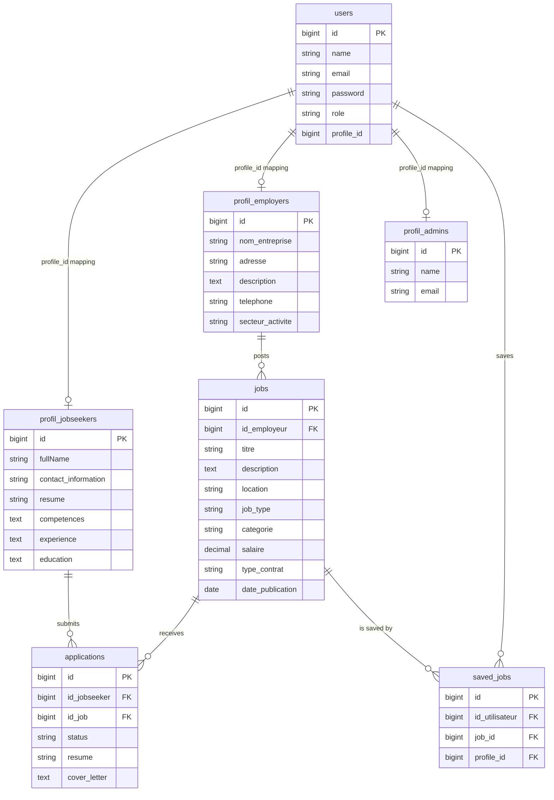

# 💼 JobBoard Platform

[](https://laravel.com)
[](https://php.net)
[](https://tailwindcss.com)
[](LICENSE)

JobBoard is a premium, modern, and feature-rich recruitment and job matching web application built on the **Laravel 10** framework. The platform provides a seamless connection between ambitious **Job Seekers** and elite **Employers**, all monitored and managed by system **Administrators**.

Equipped with role-specific dashboards, detailed applicant quality graphs, real-time email notifications, and robust job search/filter capabilities, JobBoard is designed to offer a state-of-the-art hiring experience.

---

## 🚀 Key Features by User Role

The platform utilizes a structured role system (`Admin`, `Employer`, `Job Seeker`) with specialized middleware ensuring secure route isolation.

### 👤 1. Job Seekers
* **Interactive Dashboard**: Track your dashboard details and profile stats.
* **Smart Job Search & Filters**: Filter through thousands of listings by **Category** and **Location** (built-in pagination).
* **Easy Application Pipeline**: Apply to jobs instantly by uploading a resume (PDF/DOC) and adding a tailored cover letter.
* **Saved Jobs System**: Save listings that interest you for later, and manage them directly in your saved list.
* **Profile Management**: Update and manage professional metadata including:
  * Full Name & Contact Info
  * Skills & Competences
  * Work Experience
  * Educational History
  * Uploaded Resume

### 🏢 2. Employers
* **Analytics Dashboard**: Rich visualization charts including:
  * Monthly job postings count.
  * Monthly job applications trend.
  * Candidate Quality profiles (distribution of applicants grouped by education level).
  * Fast-facts metric counters (Total jobs, total applications, unique candidates).
* **Job Listing Management (CRUD)**: Create, read, update, and delete job postings with details like title, salary, location, job type, contract type, category, and publication date.
* **Applicant Tracking**: Review candidate profiles, cover letters, and download uploaded resumes.
* **Status Action Workflow**: Dynamically accept, reject, or mark candidate applications as pending.
* **Profile Customization**: Maintain company profile details (name, sector, description, address, phone number).

### 🔑 3. Administrators
* **Centralized Dashboard**: Track platform-wide performance metrics:
  * Combined user registration growth trends.
  * Total jobs, users, and applications count.
  * Job posting type distributions (Bar / Doughnut charts).
* **Job Board Moderation**: Oversee, search, and delete job listings across the entire system.
* **User Management**: Monitor, view, search, and manage profiles for both job seekers and employers.
* **Application Management**: Review all application history and update status if necessary.

---

## 🛠️ Technology Stack

* **Backend Framework**: [Laravel 10.x](https://laravel.com/)
* **Language**: PHP 8.1+
* **Authentication**: [Laravel Breeze](https://laravel.com/docs/10.x/breeze) (customized for role-based onboarding and profile linking)
* **Frontend styling**: 
  * [Tailwind CSS 3.4.1](https://tailwindcss.com) & [Vite](https://vitejs.dev/) for blazing-fast asset building.
  * [Alpine.js 3.x](https://alpinejs.dev/) for interactive dropdowns and lightweight frontend reactive elements.
  * [Bootstrap 5.3.3](https://getbootstrap.com/) integration for selected legacy layouts.
  * [Bootstrap Icons](https://icons.getbootstrap.com/) for modern UI iconography.
* **Data Visualization**: [Chart.js](https://www.chartjs.org/) for beautiful, responsive administrative and employer dashboard charts.
* **Database**: MySQL / PostgreSQL / SQLite support via Eloquent ORM.
* **Email System**: SwiftMailer/Symfony Mailer integration for sending notifications to employers when candidates apply.

---

## 📐 Database Architecture & Models

The system implements a flexible role-based profile architecture where core authentication data is stored in the `users` table, and detailed profile metadata is partitioned into role-specific tables.



### Key Eloquent Relationships:
1. **User Profile Mapping (`User.php`)**:
   ```php
   public function profile() {
       if ($this->role === 'admin') {
           return $this->belongsTo(ProfileAdmin::class, 'profile_id');
       } elseif ($this->role === 'Job Seeker') {
           return $this->belongsTo(ProfilJobseeker::class, 'profile_id');
       } elseif ($this->role === 'employer') {
           return $this->belongsTo(ProfilEmployer::class, 'profile_id');
       }
       return null;
   }
   ```
2. **Job Listings (`Job.php`)**:
   * Belongs to an employer profile (`id_employeur`).
   * Has many applications (`id_job`).
   * Has many saved instances (`job_id`).
3. **Applications (`Application.php`)**:
   * Belongs to a job seeker (`id_jobseeker`).
   * Belongs to a job (`id_job`).

---

## 💻 Installation & Setup Guide

### 📋 Prerequisites
Ensure you have the following installed on your machine:
* PHP >= 8.1
* Composer
* Node.js & NPM
* A database server (MySQL / MariaDB / SQLite)

### 🛠️ Setup Instructions

1. **Clone the Repository**
   ```bash
   git clone https://github.com/AymanELfou/Job-Board.git
   cd Job-Board
   ```

2. **Install Composer dependencies**
   ```bash
   composer install
   ```

3. **Install NPM dependencies**
   ```bash
   npm install
   ```

4. **Environment Setup**
   Copy the example environment file and configure your settings:
   ```bash
   cp .env.example .env
   ```
   Open the `.env` file and configure your database connection parameters:
   ```env
   DB_CONNECTION=mysql
   DB_HOST=127.0.0.1
   DB_PORT=3306
   DB_DATABASE=jobboard_db
   DB_USERNAME=root
   DB_PASSWORD=
   ```
   Configure your Mail credentials (e.g., Mailtrap or SMTP) to test application notification emails:
   ```env
   MAIL_MAILER=smtp
   MAIL_HOST=sandbox.smtp.mailtrap.io
   MAIL_PORT=2525
   MAIL_USERNAME=your_username
   MAIL_PASSWORD=your_password
   ```

5. **Generate Application Key**
   ```bash
   php artisan key:generate
   ```

6. **Run Database Migrations**
   Make sure your database server is running, then run:
   ```bash
   php artisan migrate
   ```

7. **Compile Assets**
   * To build assets for local development:
     ```bash
     npm run dev
     ```
   * To build assets for production deployment:
     ```bash
     npm run build
     ```

8. **Start Local Development Server**
   ```bash
   php artisan serve
   ```
   Your application will be accessible at: `http://127.0.0.1:8000`.

---

## 🧪 Testing Suite

JobBoard includes a robust suite of PHPUnit testing covering both unit relations and feature-based route authorizations:

* **Unit Tests**: Check fillable attributes, database schema constraints, model factory definitions, and relationship integrity (`tests/Unit`).
* **Feature Tests**: Validate authenticated sessions, role-based page redirections, unauthorized route guards (role verification checks), job creation, and application workflows (`tests/Feature`).

To execute the test suite, run:
```bash
php artisan test
```

---

## 📝 License

This project is open-sourced software licensed under the [MIT license](LICENSE).
